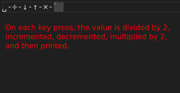
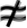

# Lectrick

Lectrick is an esoteric programming language that makes characters do things.

## Primer

Lectrick uses a monospace font internally (similar to that of your code editor).

Lectrick considers the shape and colors of characters.

Below is a list of "actions." Each action has a specific shape (some have colors too).

Consider the `HORIZONTAL WIRE` action below. The shape is a horizontal line. A couple characters that resemble this
shape include the hyphen `-`, then en dash `–`, and the em dash `—`. Other characters also may exist that resemble this
shape, and they will work too!

Electricity is measured in LE.

### Backwards Compatibility

Lectrick’s character recognition assigns the action that each character most closely resembles.

That means that if a new action is added, and this action more closely resembles a character than the previous action,
the character will now perform the new action.

Thus, before updating, you should generate an action map with the `map` command. After updating, generate another action
map, and compare the two maps to see if any characters have changed actions.

### Character Width

Some characters are wider than others. Lectrick does not account for this. You must ensure that the characters you use
form a perfect grid. The `map` command can help you visualize this.

Another tool is the `watch` command. In Jetbrains IDEs, the editor allows for variable width characters, but the
terminal does not. So, if you use the `watch` command, you can see how Lectrick interprets the characters from the
terminal while you edit the file in the editor.

### Fire

Careful! If you connect two sources of power together, they will set on fire, causing an error!

Check out one-way actions to prevent this.

## Examples

### `examples/hello`

Outputs `hello`.


### `examples/chars`

Outputs all characters from `255` to `0`, looping back to `255` after reaching `0`.


### `examples/quiet`

Outputs a character every second, unless the user presses a key, in which case it outputs nothing (it is quiet).


### `examples/press`

Prints the key pressed by the user.



## Actions

### What do these images mean?

These images are generated from sample characters that resemble the action. These sample characters are not the only
characters that will work with the action.

Think about what characters resemble the shape you see in the image, and try them out!

#### These images look weird!

The characters are stretched to fit the shape. This is to account for similar characters that have different widths or
heights.

### HORIZONTAL WIRE


Electricity flows horizontally.

### VERTICAL WIRE


Electricity flows vertically.

### CROSS WIRE


Electricity input in one direction flows out the other three directions, split evenly.

### POWER SOURCE


Electricity flows out in all directions. 255 LE is split evenly between the four directions.

### LIGHT BLOCK


When electricity flows into a light block, a character is printed. The character is determined by the amount of LE.

### ONE WAY LEFT/RIGHT

Restricts flow in one direction.

If flow is currently being restricted, the excess power will be output vertically or discarded.

This can act as a form of error handling, as colliding power results in a fire.

#### ONE WAY LEFT


#### ONE WAY RIGHT


### SPLIT/DOUBLE

Any electricity flowing into a split will be divided or multiplied by 2.

This does not split/double the electricity evenly between outputs: it just performs the operation mathematically and
outputs the result in all three directions.

#### SPLIT


#### DOUBLE


### INCREMENT/DECREMENT

Increase or decrease the amount of electricity recieved, and broadcast the new value in the 3 other directions.

If the value goes below 0 or above 255, it will be overflow, wrapping around to 255 or 0 respectively.

#### INCREMENT


#### DECREMENT


### CONDITIONAL HORIZONTAL WIRE


Electricity flows horizontally only if the wire also receives vertical electricity (top or bottom) that turn.

### PRESS DETECTOR


Electricity flows out of a press detector when the user presses a key. The amount of electricity output depends on the
key pressed.

### NOT



Electricity greater than 0 LE will not be output, and electricity equal to 0 LE will be output as 255 LE.

Note that electricity is output in both horizontal directions, so you may want to pair this with a one-way wire to
prevent it from starting a fire.

### CLOCK


A clock outputs electricity every second.

### INFINITE POWER SOURCE


This infinite power source outputs 255 LE every turn. The POWER SOURCE only outputs 255 LE once, and then it stops.

## Commands

Before running, make sure you have `uv` installed. If you have Python, grab it with:

```bash
pip install uv
```

### Run

```bash
uv run main run <file>
```

Add `--visualize` to visualize the program as it runs. You’ll probably want to adjust the size of tile names with
`--visualize-width <n>` (default is 10). Then you’ll want to add a pause with `--pause <seconds>`.

For the visualization to work well, your terminal should support ANSI escape codes. Yellow tiles are currently dealing
with electricity, red tiles have received electricity (will handle next turn), and the rest are not currently handling
electricity.

Note that `--pause` pauses 3 times per turn.

### Map

Generate a map of the actions in a file. This is useful to visualize the actions and characters in a file.

```bash
uv run main map <file>
```

### Lookup

Check what action matches a character:

```bash
uv run main lookup "<character>"
```

Add the `--generate-overlays` flag to generate images in the `overlays` directory. This is useful to visualize why a
character is not working as expected.

### Reverse Lookup

Check what characters match an action:

```bash
uv run main reverse-lookup "<action>"
```

Use the `--char-range <range>` to specify a range of characters to search through (like `--char-range 32-126` for all
printable characters or `--char-range 1000` for the first 1000 characters).

`--min-strength <strength>` can be used to specify a minimum strength for the action. This is useful for actions that
have a lot of similar characters.

### Generate Shapes

This command generates shapes for each tile. It is neccessary for the comparison of characters to actions, and it also
generates the SVGs used in the documentation.

```bash
uv run main generate-shapes
```

### CHR/ORD

Convert between characters and their ordinal values.

```bash
uv run main chr <ordinal>
uv run main ord <character>
```

### Watch

Watch a file for changes and print it’s contents.

Note: This command does not actually run the program.

```bash
uv run main watch <file>
```
